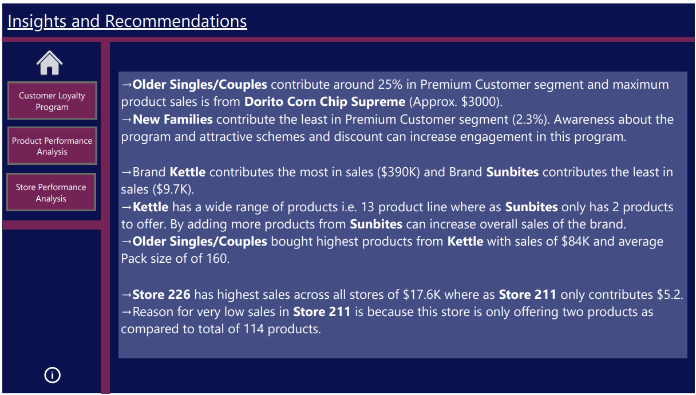

# Project - 1: Store Data Analysis
## Objective
- A large retail company has provided a dataset containing transactional data from all company stores.
- In last executive meeting, the CEO expressed concerns about the company's loyalty program and its effectiveness in retaining valuable customers.
- Also, he needs an analysis to understand which product categories and brands are performing well and which ones may require strategic adjustments.

## Dataset

## Key Proformance Indicators (KPIs)
1. Customer Loyalty Analysis:
    - Analyze the relationship between customer loyalty (Premium_Customer) and purchasing behaviour (e.g., total sales, frequency of visits, product preferences)
    - Identify any patterns or trends that could help improve the customer loyalty program and enhance customer retention strategies.

2. Product Perfromance Evaluation:
    - Analyze the sales performance of different product categories, brands and individual products.
    - Identify top-selling and underperforming products or brands.
    - Explore any correlations between product attributes (e.g., brand, life stage, pack size) and sales performance.

3. Store Performance Comparison:
    - Compare sales performance across different store locations.    
    - Identify high-performing and underperforming stores.   
    - Analyze potential factors contributing to the performance differences (e.g., product assortment, customer demographics, store layout).

Also, based on the Analysis, provide actionable insights and recommendations for the management team and suggest strategies to improve customer loyalty program.

## Tool Used:
**Power BI**

## Working
- First I have transformed the data using Power Query Editor in PowerBI to verify any missing values.
- Made sure that data is consistent and clean and checked if correct data type, data format and values are used.
- As KPIs are divided in 3 sections, so I have also created 3 Dashboards defining all three KPIs as mentioned above.
- Finally I have provided few actionable insights on how to improve sales and customer loyalty program.

## Dashboards
### Dashboard 1: Customer Loyalty Program Analysis:

### Dashboard 2: Product Performance Analysis:

### Dashboard 3: Store Performance Analysis:

## Insights and Recommendations

